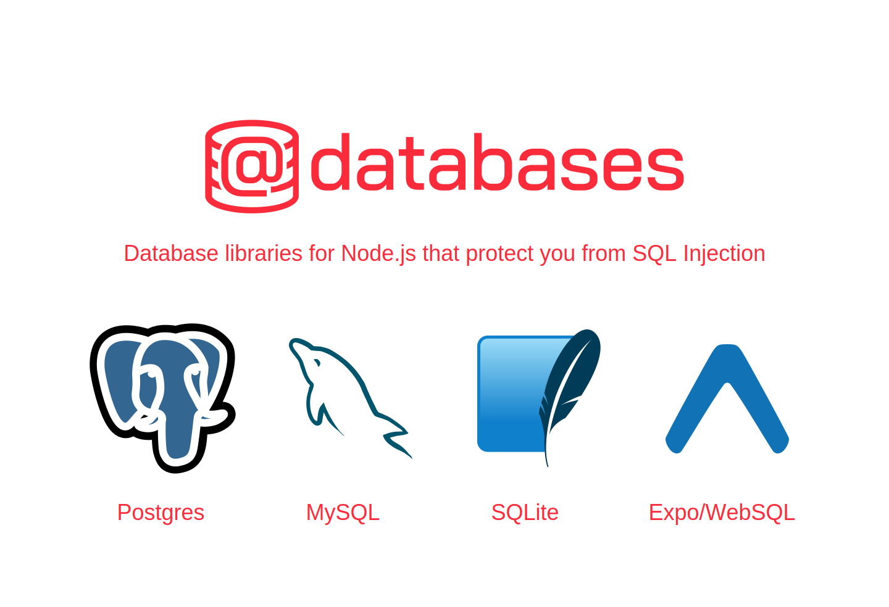

<div align="center">
  <a href="https://www.atdatabases.org/">
    
  </a>
</div>

## Safe From HTML Injection

Using tagged template literals for queries, e.g.

```ts
db.query(sql`SELECT * FROM users WHERE id=${userID}`);
```

makes it virtually impossible for SQL Injection attacks to slip in un-noticed. All the @databases libraries enforce the use of the sql tagged template literals, so you can't accidentally miss them.

The query is then passed to your database engine as a separate string and values:

```js
{text: 'SELECT * FROM users WHERE id=?', values: [userID]}
```

## Promises

All the @databases APIs are designed with promises in mind from the get go.

## TypeScript

Written in TypeScript, so every module has type safety and type definitions built in.

## Modular

Each database driver is published to npm as a separate module, so you don't need to install the ones you don't need.

> Check out the website to learn more: https://www.atdatabases.org/