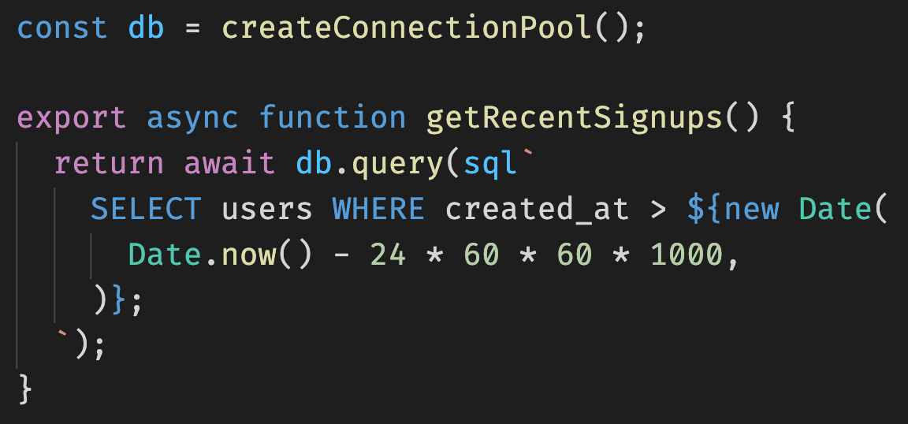
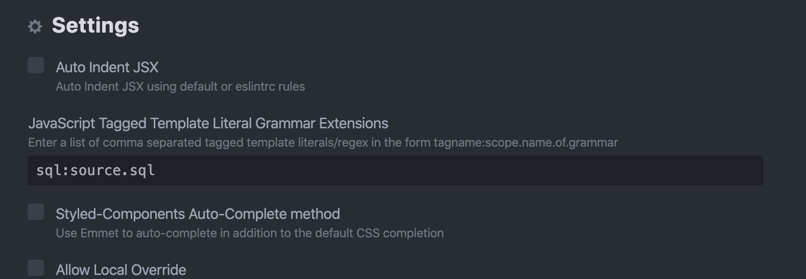

In `@databases` you will use a lot of SQL strings inline within your TypeScript or JavaScript code. These strings are always "tagged" with the `sql` prefix, meaning we can use plugins to ensure they are highlighted as SQL, rather than just a string.

## VS Code Syntax Highlighting Extension

The [`vscode-sql-template-literal` extension](https://marketplace.visualstudio.com/items?itemName=forbeslindesay.vscode-sql-template-literal) provides syntax highlighting for VS Code:

## Atom Syntax Highlighting Plugin

> This doesn't seem to be working at the moment: https://github.com/gandm/language-babel/issues/525

To enable highlighting, you need to:

1. Install the `language-babel` package.
1. Configure `language-babel` "JavaScript Tagged Template Literal Grammar Extensions" setting to use `source.sql` to highlight template literals with `sql` tag (configuration value: `sql:source.sql`).

For more information, refer to the [JavaScript Tagged Template Literal Grammar Extensions](https://github.com/gandm/language-babel#javascript-tagged-template-literal-grammar-extensions) documentation of `language-babel` package.
